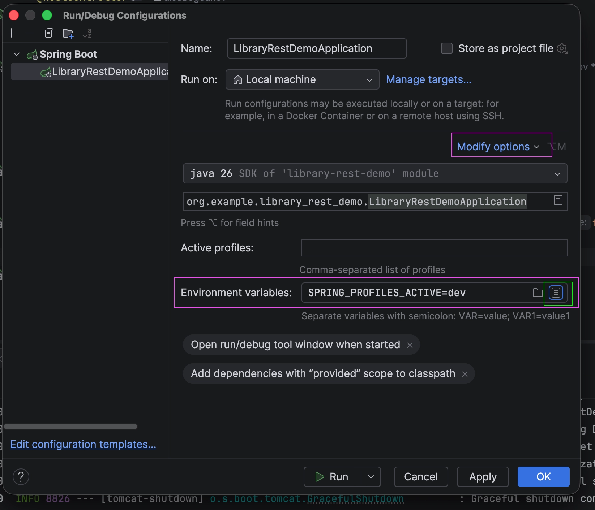

# Application configuration in Boot.

## Lesson Objectives

1. Switch from `application.properties` to `application.yaml` and understand when and why the latter format is more convenient.
2. Learn to define different settings for different profiles through separate files (`application-dev.yaml`, `application-prod.yaml`), without manually activating the profile in your code.
3. Replace a set of separate `@Value` fields with a single type-safe configuration class using `@ConfigurationProperties`.

**Link to the previous lesson:** There, you saw that Spring Boot automatically includes `application.properties`, without `@PropertySource` and without the encoding issues encountered in one of the Spring Core lessons. Today, we'll explore two developments of this same idea: a different file format (YAML) and a more convenient way to read values ​​from it (a single configuration class instead of a set of `@Value`).

---

## Part 1. application.yaml instead of .properties

### 1.1 Why change the format

Imagine that in `application.properties` you have ten keys instead of two, all with the same prefix:

```
library.name=City Library
library.lateFeePerDay=15
library.contact.email=library@example.org
library.contact.phone=+7 999 123-45-67
```

The `library.` and `library.contact.` prefixes are repeated on every line—reading such a file becomes difficult as the number of settings increases. YAML is a different configuration file format that allows you to express the same nesting through indentation, without repeating the prefix on every line:

```yaml
library:
name: City Library
lateFeePerDay: 15
contact:
email: library@example.org
phone: "+7 999 123-45-67"
```

This is the same settings set, just written differently. If you remove the indentation and reverse the nesting using dots, you'll get exactly the file from the example above.

- 1.2 Basic YAML Syntax

1. Nesting is defined by indentation

YAML doesn't use curly braces or dots. Instead, it uses spaces.

```yaml
library:
name: City Library
contact:
email: library@example.org
```

Here, `name` and `contact` are properties of the `library` object.

---

2. Only spaces are used

Spaces are used for indentation, not the Tab key.

Typically, two spaces are used for each nesting level.

✅ Correct

```yaml
library:
contact:
email: library@example.org
```

❌ Incorrect

```yaml
library:
<Tab>contact:
```

---

**3. A colon is placed after the key**

Each property is written as

```yaml
key: value
```

For example

```yaml
name: Library
port: 8080
```

---

**4. A space is placed after the colon**

This rule is mandatory.

✅

```yaml
port: 8080
```

❌

```yaml
port:8080
```

---

**5. Lists are written with a hyphen**

```yaml
genres:
- Fantasy
- Science Fiction
- Detective
```

This is read as:

> `genres` is a list consisting of three elements:
> 1. Fantasy
> 2. Science Fiction
> 3. Detective

The same in JSON:

```json
{
"genres": [
  "Fantasy",
  "Science Fiction",
  "Detective"
  ]
}
```

The same can be represented as an array.

---

**6. Quotation marks are usually optional**

You can write it like this

```yaml
name: Library
```

or like this

```yaml
name: "Library"
```

Quotation marks are used if the value contains special characters, a colon, begins with spaces, or if you need to explicitly preserve the string type.

For example:

```yaml
phone: "+7 999 123-45-67"
```

---

**7. Comments start with `#`**

```yaml
server:
port: 8080

# Library settings
library:
name: Library
```

---

**8. YAML replaces long prefixes**

Instead of

```
library.name=Library
library.contact.email=test@example.com
library.contact.phone=12345
```

you can write

```yaml
library:
name: Library
contact:
email: test@example.com
phone: 12345
```

The file becomes more compact and easier to read.

---

**Quick Reminder**

| Rule | Example |
| --- | --- |
| Nesting — separated by spaces | `library:` → `name:` ​​|
| Only spaces, no Tabs | `name:` ​​|
| `:` is used after the key | `port: 8080` |
| A space is required after `:` | `name: Library` |
| List — separated by `-` | `- Java` |
| Comments start with `#` | `# comment` |

---

- 😄 Why such a strange name?

It's almost a "joking" name:

- YAML used to stand for **"Yet Another Markup Language"**
- then the authors deliberately changed the meaning to
  👉 "YAML *Ain't* Markup Language"
  (that is: *it's not a markup language*)

YAML is:

👉 a data format for configurations
👉 a way to store structure (like JSON, but more human-friendly)

---

### Exercise 1. Correct the errors (easy)

The file contains formatting errors. Correct it so that it becomes valid YAML.

```yaml
app:
name: My Application
version:1.0

database:
host: localhost
port:5432

#Answer
app:
name: My Application
version: 1.0

database:
host: localhost
port: 5432
```

---

### Exercise 2. Translate to YAML (Intermediate)

Transform the `application.properties` file into `application.yml`.

```
app.name=Weather Service
app.version=2.1

server.port=8080

database.host=localhost
database.port=5432
database.username=admin
database.password=secret

#Answer
app:
name: Weather Service
version: 2.1

server:
port: 8080

database:
host: localhost
port: 5432
username: admin
password: secret

```

---

### Exercise 3. Create YAML yourself (intermediate)

Create the `application.yml` file according to the following description.

Online store settings:

- Store name — **Tech Store**;
- Currency — **USD**;
- Maximum quantity of items in the cart — **20**;
- Support:
- Email — **support@techstore.com**;
- Phone — **+1 800 555-1234**.

Define the nesting structure yourself.

---

### Exercise 4. Find errors in logic (advanced)

The developer wanted to get the following structure:

```
user
├── name
├── age
└── address
    ├── city
    └── street
```

But wrote:

```yaml
user:
name: Alice
age: 25
address:
city: London
street: Baker Street
```

---

**Questions:**

1. What's wrong here?
2. What should the correct YAML look like?
3. Which properties are at the top level in the current version?


### ⭐ Tricky Question

Which of the following files are valid YAML?

**A**

```yaml
server:
port: 8080
```

**B**

```yaml
server:
port: 8080
```

**C**

```yaml
server:
port:8080
```

**D**

```yaml
server:
port: 8080
ssl:
enabled: true
```
---

### 1.2 How to enable

Simply rename (or recreate) the `src/main/resources/application.properties` file to `src/main/resources/application.yaml` and move the YAML syntax settings there. No new annotations are required—Spring Boot enables `application.yaml` automatically, just like it enabled `application.properties` in the previous lesson. Use only one of the two files at a time in your project (either `.properties` or `.yaml`) – if you leave both with the same keys, it won't be clear which value will be applied.

### 1.3 How to get a value from YAML in code

The `application.yaml` file is simply a settings store. To use a value from it in a Java class, Spring Boot provides the `@Value` annotation.

Let's say `application.yaml` contains:

```yaml
library:
name: City Library
lateFeePerDay: 15
```

To read `library.name` in a controller, we write:

```java
@RestController
public class CatalogController {
  
  private final String libraryName;
  
  public CatalogController(@Value("${library.name}") String libraryName) {
    this.libraryName = libraryName;
  }
  
  @GetMapping("/library-name")
  public String libraryName() {
    return libraryName;
  }
}
```

Parse:

- `@Value("${library.name}")` — the `${...}` syntax within a string tells Spring: "Find the `library.name` key in the settings and substitute its value here." YAML nesting (indentation) is expanded back to dot notation — `lib rary.name` is the same as `library.name=...` in the `.properties` file.
- If the key is not found, the application will fail to start and throw an error. This is intentional: it's better to immediately see that the setting is missing than to get `null` at runtime.
- `@Value` can be placed on a constructor parameter (as here), on a field, or on a setter — Spring supports all three, but the constructor method is preferred for the same reasons as regular constructor injection for dependencies.

For numeric types, everything works similarly—Spring automatically converts the string "15" from the file to an int:

```java
public CatalogController(
  @Value("${library.name}") String libraryName,
  @Value("${library.lateFeePerDay}") int lateFeePerDay) {
    this.libraryName = libraryName;
    this.lateFeePerDay = lateFeePerDay;
}
```

This works, but the approach has a limitation that becomes noticeable as the number of configurations increases—more on that in Part 3.

---

## Part 2. Profiles and Environment Strategy in Boot

### 2.1 What's Not Changing

`@Profile` on beans (`@Profile("dev")`, `@Profile("prod")`) works in Boot exactly the same way as you saw in the Spring Core lesson—the bean is created only if the specified profile is active.

### 2.2 What's Changing: Profile-Specific Configuration Files

In Spring Core, you had **one** configuration file, and switching profiles only affected which beans were created, not which configuration values ​​were loaded. In Boot, a profile can also include a **separate configuration file on top of the main one.** Naming convention: if the main file is named `application.yaml`, then the file for the `dev` profile is named `application-dev.yaml`, and for the `prod` profile, it is named `application-prod.yaml`. When the `dev` profile is active, Boot loads `application.yaml` first, then `application-dev.yaml`. If a key is present in both files, the value from the profile file wins.

Example. `application.yaml` (general settings, independent of environment):

```yaml
library:
lateFeePerDay: 15
```

`application-dev.yaml`:

```yaml
library:
name: Test library (dev)
```

`application-prod.yaml`:

```yaml
library:
name: City library
```

When the `dev` profile is active, the final value of `library.name` is `"Test library (dev)`, and `library.lateFeePerDay` is still taken from the general `application.yaml` because there is no such key in `application-dev.yaml`. When the `prod` profile is active, `library.name` becomes `"City library"`.

### 2.3 How to activate a profile now

In the Spring Core lesson, to activate a profile, we had to break context creation into steps (`new AnnotationConfigApplicationContext()` → `setActiveProfiles(...)` → `register(...)` → `refresh()`) because the profile had to be set manually before building the beans. In Boot, `SpringApplication.run(...)` does this automatically—it just needs to know the active profile name in advance, and it will pick up the necessary `application-*.yaml` files automatically, without a single line of code in `main()`.

You can specify the profile in the same way as we discussed methods 1 and 2 in the Spring Core lesson (using `-D` or an environment variable)—this works without changes in Boot. The most convenient way to launch from IntelliJ is via Run Configuration:
1. `Run` → `Edit Configurations...`
2. Select the launch configuration for your `@SpringBootApplication` class
3. In the `Environment variables` field, enter `SPRING_PROFILES_ACTIVE=dev`
4. `OK`, run as usual



After launching, IntelliJ will open the **Run** tab at the bottom of the screen. There will be a stream of text; these are the application logs. Among them, find the line:

```
The following 1 profile is active: "dev"
```

In context, it looks something like this:

!image.png

If this line is missing, it means the profile wasn't passed, and Boot started without a profile (with only the settings from `application.yaml`).

### 2.4 How to verify that the correct profile was picked up

A log at startup is good, but you want to see not just "profile active," but what exactly was loaded from the correct file. The easiest way is to add a temporary endpoint that returns a value that should be different in `dev` and `prod`.

Let's take the example from 2.2: `library.name` is different in `application-dev.yaml` and `application-prod.yaml`. Add the following endpoint to `CatalogController`:

```java
@GetMapping("/library-name")
public String libraryName(@Value("${library.name}") String libraryName) {
return libraryName;
}
```

Run with the `dev` profile, open `http://localhost:8080/library-name` in the browser and see:

```
Test library (dev)
```

Switch to `prod` (change the variable in Run Configuration to `SPRING_PROFILES_ACTIVE=prod`), restart, open the same address and see:

```
City library
```

If the value hasn't changed, it means the profile wasn't picked up (most often, the environment variable was entered with a typo or the file was named incorrectly).

---

## Part 3. @ConfigurationProperties

### 3.1 Problem: Too Many Separate @Values

In the last lesson, you read the settings like this:

```java
@RestController
public class CatalogController {
  
  private final String libraryName;
  
  public CatalogController(@Value("${library.name}") String libraryName) {
    this.libraryName = libraryName;
  }
}
```

This works, but it doesn't scale well: if `library` has five more settings (`lateFeePerDay`, `contact.email`, `contact.phone`, etc.), you'll have to write five separate parameters with `@Value` in the constructor, and then repeat `@Value("${library...}")` again in every place where at least one of these settings is needed. The settings themselves then exist only as separate parameters, not as a single "library configuration" object.

### 3.2 Solution: A Separate Configuration Class

Create a class that describes **all** settings with the `library` prefix at once:

```java
package org.example.libraryrestdemo;

import org.springframework.boot.context.properties.ConfigurationProperties;
import org.springframework.stereotype.Component;

@Component
@ConfigurationProperties(prefix = "library")//"This class needs to be populated with configuration data."
public class LibraryProperties {
  
  private String name;
  private int lateFeePerDay;
  
  public String getName() {
    return name;
  }
  
  public int getLateFeePerDay() {
    return lateFeePerDay;
  }
  public void setName(String name) {
    this.name = name;
  }
  public void setLateFeePerDay(int lateFeePerDay) {
    this.lateFeePerDay = lateFeePerDay;
  }
}
```

Parsing:
- `@Component` — here does exactly the same as on any other class: registers it as a bean via component scanning, which you already know. No separate "magic" registration for configuration is required.

- `@ConfigurationProperties(prefix = "library")` — tells Spring Boot: "Find all settings whose key starts with `library.` and substitute them into the fields of this class by name." The `name` field will be mapped to `library.name`, and the `lateFeePerDay` field will be mapped to `library.lateFeePerDay`. The class doesn't have a declared constructor, meaning Java automatically supplies an empty, parameterless constructor, as it does for any class where you've never written a constructor. That's why the fields aren't final : otherwise, there would be nothing to assign values ​​to them after the object is created. Since the empty constructor doesn't accept anything, Spring Boot can't pass values ​​through it. Instead, it creates the object through the empty constructor and then calls setters—setName(...) and setLateFeePerDay(...)—one for each setting found, determining the correct setter based on the field name (name → setName, lateFeePerDay → setLateFeePerDay). This method is called JavaBean binding. This mechanism is called configuration binding and works the same for both application.properties and application.yaml — LibraryProperties doesn't know and shouldn't know which file format the values ​​actually came from.

### 3.3 Why Not a Parameterized Constructor

In previous lessons, you always made fields final and populated them through the constructor — it might seem logical to do the same here:

```java
@Component
@ConfigurationProperties(prefix = "library")
public class LibraryProperties {
  
  private final String name;
  private final int lateFeePerDay;
  
  public LibraryProperties(String name, int lateFeePerDay) {
    this.name = name;
    this.lateFeePerDay = lateFeePerDay;
  }
  
  // getters
}
```

If you write it exactly like this, the application won't start, and the following error will appear in the startup log:

```
UnsatisfiedDependencyException: Error creating bean with name 'libraryProperties':
Unsatisfied dependency expressed through constructor parameter 0:
No qualifying bean of type 'java.lang.String' available: expected at least 1 bean
which qualifies as an autowire candidate
```

The reason is that @Component registers the class as a regular bean through component scanning, just like CatalogController or any other class. And the regular bean creation mechanism, when encountering a constructor with parameters, does what you've seen many times before—**constructor dependency injection**: it tries to find a bean of the same type in the context for each parameter. But there are no beans of type `String` or `int` in
the context—there are only configuration values with those names, and a bean and a configuration value are not the same thing. This is the source of the "No qualifying bean of type 'java.lang.String'" error.

This is why, for settings classes registered via `@Component`, setters are used instead of constructors, as in 3.2—this prevents configuration binding from being confused with regular dependency injection.

### 3.4 Using @Value Instead

The class that previously required separate `@Value` now requests the entire `LibraryProperties` object—this is regular constructor-based dependency injection, without any new annotations:

```java
package org.example.libraryrestdemo;

import org.springframework.web.bind.annotation.GetMapping;
import org.springframework.web.bind.annotation.RestController;

@RestController
public class CatalogController { 
  
  private final LibraryProperties libraryProperties; 
  
  public CatalogController(LibraryProperties libraryProperties) { 
    this.libraryProperties = libraryProperties; 
  } 
  
  @GetMapping("/library-name") 
  public String libraryName() { 
    return libraryProperties.getName(); 
  } 
  
  @GetMapping("/late-fee") 
  public int lateFee() { 
    return libraryProperties.getLateFeePerDay(); 
  }
}
```

`LibraryProperties` is a bean like any other, so it can be injected into the `CatalogController` constructor in the same way as you implemented `BookCatalog` or `NotificationChannel` in previous lessons - no difference for the container.

### 3.4 Why this is better than the @Value set

- All related settings are collected in one place - when you open `LibraryProperties`, you immediately see a complete list of what can be configured for the library, rather than looking for `@Value` scattered throughout the project.
- If a new setting is added, only the `LibraryProperties` class itself changes (the new field and constructor parameter), and not each place where there was previously a separate `@Value`.
- You get a typed object (`int lateFeePerDay`, and not a string that would need to be parsed somewhere in the code) - Spring Boot itself performs type conversion when binding, just like `@Value` did for single values.

---

# Laboratory work – Coffee house “Bodrost”

Topic: backend for a small chain of coffee shops. In the `dev` environment the application looks at the test point, in the `prod` environment it looks at the real one. You need to go all the way: from raw YAML to a type-safe configuration class.

## Start code

Create a new project via Spring Initializr (dependency: **Spring Web**), package `org.example.coffeeshop`.

**`CoffeeShopApplication.java`** - already generated, do not change.

**`OrderController.java`** - create this file while it is empty:

```java
package org.example.coffeeshop;

import org.springframework.web.bind.annotation.RestController;

@RestController
public class OrderController {

}
```

**`src/main/resources/application.yaml`** - create an empty file (remove `application.properties` if it exists).

---

### Task 1 - Fill in YAML

Write the following settings in `application.yaml`:

| Key | Meaning |
| --- | --- |
| `server.port` | `8081` |
| `coffee.shop.name` | `Cheerfulness` |
| `coffee.shop.city` | `Haifa` |
| `coffee.shop.max-orders` | `200` |
| `coffee.shop.delivery-fee` | `"+972 567 789 012"` (support phone) |

Run the application - it should start on port `8081` without errors.

---

### Task 2 - Add profiles

Create two profile files next to `application.yaml`:

**`application-dev.yaml`** should contain:
- `coffee.shop.name`: `Cheerfulness (test)`
- `coffee.shop.max-orders`: `10`

**`application-prod.yaml`** should contain:
- `coffee.shop.name`: `Cheerfulness`
- `coffee.shop.max-orders`: `200`

In `application.yaml`, leave only `server.port` and `coffee.shop.city` - they are the same for all environments.

Activate the `dev` profile via Run Configuration (`SPRING_PROFILES_ACTIVE=dev`). The following should appear in the logs at startup:

```
The following 1 profile is active: "dev"
```

---

### Task 3 - Read settings via @Value

Add two GET endpoints to `OrderController` that return values from the current profile:

- `GET /shop-name` → returns the name of the coffee shop (string)
- `GET /max-orders` → returns the maximum number of orders (number)

Use `@Value` to get values.

Testing: run from `dev`, open `http://localhost:8081/shop-name` - should return `Cheerfulness (test)`. Switch to `prod` - it should return `Cheerfulness`.

---

### Task 4 - Replace @Value with @ConfigurationProperties

Create a class `CoffeeShopProperties` in the same package. He must:
- Be registered as a bean
- Link to the `coffee.shop` prefix
- Store three fields: `name` (String), `city` (String), `maxOrders` (int)
- Have a constructor and getters

Rewrite `OrderController`: remove all `@Value` parameters, implement `CoffeeShopProperties` through the constructor and return values through it.

Add a third endpoint `GET /info` that returns a string like:

```
Coffee house "Bodrost" - Minsk, max. orders: 200
```

(values are taken from `CoffeeShopProperties`).

Make sure that when you switch profiles, the name and order limit change, but the city remains the same.

---
